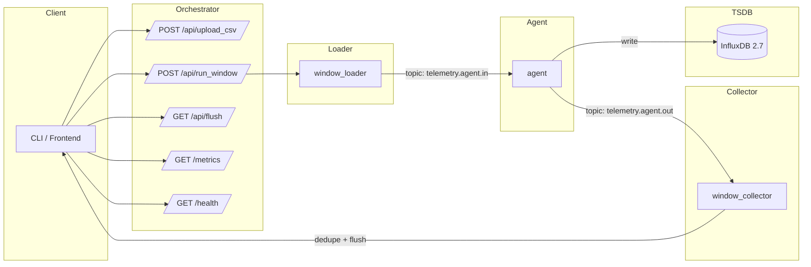

# TFG Data Pipeline — Week 2

## 🎯 Objectiu de la setmana
Implementar un pipeline **E2E** d’ingesta i processament amb **Kafka + InfluxDB**, operable via **API** i verificable amb comandes simples.

Aquesta setmana hem:
- Afegit **ingesta des de CSV/Parquet** (i mantenim el format a la sortida).
- Tancat el flux **Loader → Agent → InfluxDB → Collector → Orchestrator**.
- Exposat **health i mètriques** bàsiques.
- Activat **auto‐gestió** de dades (cap per unitat + purge).
- Documentat **com verificar** tot amb `curl`.

---

## 🏗️ Arquitectura



---

## 🧰 Serveis

- **Zookeeper** · coordinació de Kafka  
- **Kafka** · bus d’esdeveniments (`telemetry.agent.in`, `telemetry.agent.out`, `telemetry.processed`)  
- **InfluxDB 2.7** · emmagatzematge de sèries temporals (bucket `pipeline`)  
- **window_loader** · ingesta de fitxers i publicació a Kafka  
- **agent** · consum de Kafka, escriptura a Influx i re‐emissió a Kafka  
- **window_collector** · dedupe (últim per clau) + `flush` a disc (CSV/Parquet)  
- **orchestrator** · API central (upload, trigger, flush, mètriques, health)

---

## 🚀 Desplegament

```bash
# Construcció i arrencada
docker compose build
docker compose up -d

# Logs d’un servei
docker compose logs -f agent
```

> **Ports per defecte**: Orchestrator `8081`, Collector `8082`, InfluxDB `8086`.

---

## 🧪 Flux end‑to‑end

### 1) Pujar un CSV
```bash
curl -s -X POST http://localhost:8081/api/upload_csv \
  -F "file=@data/test_csvs/test_small.csv"
```

### 2) Executar la finestra/procés
```bash
curl -s -X POST http://localhost:8081/api/run_window | jq
```
Exemple de resposta:
```json
{
  "triggered": true,
  "status_code": 200,
  "loader_response": {
    "rows": 5,
    "path": "/app/data/processed_window.csv"
  }
}
```

### 3) Consultar el Collector (dedupe + flush)
```bash
curl -s http://localhost:8082/flush | jq
```
Exemple:
```json
{
  "rows": 5,
  "path": "/app/data/processed_window.csv"
}
```

### 4) Validar a InfluxDB (API HTTP)
> Recomanat usar rang d’**últimes 24h** per a dades de test amb timestamps antics.
```bash
curl -s "http://localhost:8086/api/v2/query?org=tfg" \
  -H "Authorization: Token admin_token" \
  -H "Accept: application/csv" \
  -H "Content-Type: application/vnd.flux" \
  -d 'from(bucket:"pipeline") |> range(start:-24h) |> limit(n:10)'
```

---

## 📊 Mètriques exposades (Orchestrator)

### JSON
```bash
curl -s http://localhost:8081/metrics | jq
```
Sortida típica:
```json
{
  "uptime_sec": 120,
  "points_written": 0,
  "last_flush_rows": 5
}
```

### Prometheus
```bash
curl -s http://localhost:8081/metrics/prometheus
```
```
uptime_sec 120
points_written 0
last_flush_rows 5
```

> **Nota**: `points_written` és un placeholder; es generalitzarà amb mètrica real a l’Agent (veure “Next Week”).

---

## 🧹 Auto‑gestió de dades (Agent)

- **Límit per unitat**: `MAX_ROWS_PER_UNIT` (per defecte: `1000`).  
- Si se supera, s’aplica purge de punts **antics** (finestra defensiva de 7 dies).  
- Objectiu: evitar creixements descontrolats i mantenir la TSDB lleugera.

> Proper pas: alinear la política de purge amb `RETENTION_HOURS` o retenció nativa del bucket (7d).

---

## ✅ Checklist Week 2

- [x] Loader amb suport **CSV i Parquet**  
- [x] Agent **escriu a InfluxDB** (measurement `telemetry`, tag `unit`)  
- [x] Collector guarda **última versió per clau** i fa **flush** (CSV/Parquet)  
- [x] Orchestrator amb APIs `/upload_csv`, `/run_window`, `/flush`, `/metrics`, `/health`  
- [x] Mètriques bàsiques (JSON + Prometheus)  
- [x] Auto‑gestió de dades activa (cap + purge)  
- [x] Documentació per verificació E2E

---

## 🧪 (Opcional) Smoke test de 1 minut

```bash
#!/usr/bin/env bash
set -euo pipefail

ok(){ echo "OK: $1"; }
fail(){ echo "FAIL: $1"; exit 1; }

# 1) Upload
curl -fsS -X POST http://localhost:8081/api/upload_csv \
  -F "file=@data/test_csvs/test_small.csv" >/dev/null || fail "upload"

# 2) Run
curl -fsS -X POST http://localhost:8081/api/run_window >/dev/null || fail "run_window"

# 3) Flush collector
rows=$(curl -fsS http://localhost:8082/flush | jq -r '.rows') || fail "flush"
[[ "$rows" -ge 1 ]] || fail "collector rows = $rows"
ok "collector rows = $rows"

# 4) Query Influx (24h)
q=$(curl -fsS "http://localhost:8086/api/v2/query?org=tfg" \
    -H "Authorization: Token admin_token" \
    -H "Accept: application/csv" \
    -H "Content-Type: application/vnd.flux" \
    -d 'from(bucket:"pipeline") |> range(start:-24h) |> limit(n:1)')
echo "$q" | grep -q "_measurement" || fail "influx query"
ok "influx query retornada"
```

---

## 📌 Next Week (millores planificades)

- **Retenció consistent**  
  - **Opció A**: mana Influx (7d) + cap per unitat a l’Agent  
  - **Opció B**: usar `RETENTION_HOURS` a l’Agent i documentar la política
- **Mètriques reals**  
  - Exposar `agent_points_written` (Prometheus) o reportar a l’Orchestrator
- **Timestamps “dev‑friendly”**  
  - Flag `FORCE_NOW=true` per veure dades amb `range(-5m)`
- **Resiliència**  
  - Retries/backoff i logs d’error amb context (Kafka/HTTP)
- **Docs**  
  - README ampliat + troubleshooting ràpid

---

## 🛠️ Troubleshooting (ràpid)

- **No veus dades amb `-5m`** → probablement timestamps antics al CSV. Prova `-24h` o activa `FORCE_NOW=true` a l’Agent.  
- **“Closing connection” als logs de Kafka** → és **normal** (connexió bootstrap i després al líder).  
- **CLI Kafka al contenidor** → pot no estar disponible; valida amb **Collector `/flush`** i la **API d’Influx**.
